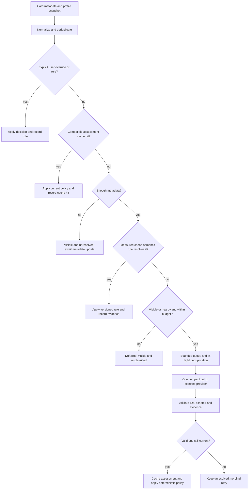

# FocusFeed routing workflow and latency plan

Decision after the v4 development review: prioritize the combined workflow before further prompt-only tuning. Checkpoint 1 is implemented for explicit rules and controlled cache replay. Semantic cache decisions and model routing are not yet allowed to hide cards in the live feed.

The follow-up review found cache validation/concurrency faults and gaps in what the replay proves. See [WORKFLOW_EVALUATION_PLAN.md](WORKFLOW_EVALUATION_PLAN.md) for reproduced findings, planned fixes, independent test expectations, latency measurements, and manual handoffs. Passing the original 20 cases does not qualify the complete workflow; strengthen and correct checkpoint 1 before queue/provider integration.

## Evidence and current implementation

V4 takes 4m51.9s for 24 videos on this device, averaging 48.7s per four-video batch. Inference accounts for 84.4%, session setup for 15.6%. All 24 recorded decisions match their references, but the finance loss-story relevance error remains unsafe under Focus policy. See `eval_reports/2026-09-20-few-shot-v4-development-analysis.md`.

- `extension/content.js` already applies explicit channel, keyword, format, duration, and feedback rules. It reads the active goal but does not invoke the semantic classifier.
- `extension/eval/eval.js` evaluates every fixture directly through the local LLM. It is a classifier benchmark, not an end-to-end filtering or workflow benchmark.
- `extension/local-classifier.js` creates and destroys an isolated session for every batch, generating topics, purpose, three policy labels, evidence, and a reason.
- `backend/classifier.py` already wraps Bedrock with a Strands Agent. Its mere presence does not supply a cache, queue, or routing workflow, and local prompt changes do not automatically change the Bedrock prompt.

The original plan included rules and cache. Establishing a model baseline was useful, but optimizing its few-shot examples alone does not validate the product's latency requirements.

## Workflow

Most stages are ordinary code. Few-shot prompting stays inside the semantic classification node. Do not add a model invocation to route every video or make every stage an agent. Do not add a critic call to every assessment. A bounded repair/escalation becomes a separate experiment only after a measured quality gain justifies its latency and cost.

For AWS, keep the existing Strands/Bedrock node behind the same provider contract. A Strands graph with custom deterministic nodes is an option when backend branching warrants it; a client-side cache hit should not need a network trip through a cloud orchestrator. Strands documents deterministic graph nodes and conditional edges in its [Graph guide](https://strandsagents.com/docs/user-guide/concepts/multi-agent/graph/).

## What qualifies for a fast decision

| Situation | Treatment |
| --- | --- |
| Explicit per-video show/hide | Apply immediately with documented override precedence |
| Explicit allow/block channel | Use stable channel ID, or clearly defined exact normalized identity when unavailable |
| User explicitly enabled a literal blocked-keyword rule | Apply its documented literal matching; record that it was a user rule |
| Verified Shorts/live/premiere flag plus matching format preference | Apply immediately |
| Reliable duration outside the selected limit | Apply immediately; unknown duration does not establish format |
| Same video and compatible metadata/profile/model/prompt/schema | Reuse cached assessment, then apply current policy |
| Missing meaningful metadata | Keep visible and unresolved; react to updated metadata without repeatedly invoking the model |
| Positive topic cue plus instructional format, no conflict | Candidate for a separately evaluated conservative allow rule |
| Narrow entertainment-format cue matching unwanted intent | Candidate for a separately evaluated hide rule, with exception/conflict checks |
| Conflicting topics, negation, criticism, cautionary story, unknown vocabulary | Defer to semantic evaluation or abstain |

Explicit user rules and inferred semantic rules need separate provenance and metrics. Do not silently translate natural-language unwanted topics into substring blocks. A goal setup step may propose structured predicates once per profile version; the user reviews their meaning. Avoid generating executable code from the model.

Checkpoint 1 fixed two unsafe rule behaviors: missing duration no longer implies Shorts, and channel allow/block rules now require exact normalized names or handles. Cache writes are ignored by the content script's narrowed storage-change listener, so they do not reprocess the feed.

Begin with explicit rules and exact cache reuse. Enable inferred semantic fast rules only after measuring coverage and false hides on independent examples. Do not invent a coverage percentage or interpret a similarity score as calibrated confidence. If this leaves too many residual calls, evaluate a small local discriminative classifier later with real corrected labels; embeddings may help route cases but topic similarity alone cannot establish unwanted intent.

## Cache and scheduler contract

- Cache assessments using video ID, all relevant metadata fingerprint, profile content/version, provider/model identity available to us, prompt/schema version, and TTL. Reapply policy and explicit overrides rather than caching the final DOM action forever.
- Keep an in-memory hot cache backed by bounded persistent storage with expiry and eviction. Record provider failures separately; do not turn timeout fallbacks into successful cached classifications.
- Deduplicate repeated cards and outstanding requests by the same context key. One result can update several cards, but each card must still represent the same video and current profile before application.
- Prioritize currently visible cards, then approximately one screen ahead. Do not send every extracted offscreen recommendation to the model.
- Initial experiment: one local request at a time, queue cap of 24 unique eligible candidates, batches of 1/2/4 compared rather than assuming 4 is optimal. Cap scheduling wait at 100ms. These are experiment settings, not validated optimal values.
- Remove obsolete candidates on navigation, profile changes, or queue expiry. Retain pending shared requests only while they have relevant subscribers. Never let rapid scrolling create an unbounded backlog.
- Use provider-specific time budgets and a circuit breaker. Timeout or overload means visibly unresolved, not secretly "relevant." Keep scrolling responsive, and do not retry each failed batch in a loop.
- Track card discovery, queue admission/start, model start/end, and DOM application timestamps independently.

## Reduce the remaining model cost

1. **Compact output experiment:** retain video ID, goal relevance, unwanted match, evidence sufficiency, and a bounded evidence/preference reference. Omit generated topic lists, primary purpose, and verbose prose from the live decision path. Build explanations from the actual stored evidence and decision rule. Mark omitted fields as not assessed; do not fabricate them to satisfy the old evaluation schema. Keep full v4 available as a benchmark.
2. **Session experiment:** create a base session containing only stable instructions/examples, clone it for isolated batches, destroy clones, and release the base after inactivity or configuration change. Never clone a session polluted by earlier feed results. Measure clone/setup time rather than assuming it vanishes. Chrome explicitly recommends this pattern in its [built-in AI guidance](https://developer.chrome.com/docs/ai/built-in-ai-dos-donts).
3. **Runtime ownership:** local model lifetime must belong to an extension document independent of the popup. Verify that runtime and lifecycle in the user's browser. Do not assume the service worker can invoke the Prompt API; Chrome's [Prompt API documentation](https://developer.chrome.com/docs/ai/prompt-api) states that Web Workers are unsupported. A generic offscreen document is not automatically a verified solution either.
4. **Batch benchmark:** compare first usable result latency, throughput, output coverage, and queue age at batch sizes 1/2/4. More concurrent local generations may compete for the same device resources. Measure before increasing concurrency.
5. **Bedrock benchmark:** when account access works, run the same eligible inputs and compact contract against the configured model. Measure network, inference, cold-start, throttling, and cost separately. No current result proves cloud speed. Local-only mode must not silently fall back to a paid provider.

Even perfect removal of session setup leaves roughly 41s of inference per batch at present. Cache/routing and smaller outputs are all needed, and their combined improvement must be measured. A responsive page with pending semantic decisions is different from an entirely classified feed within seconds.

## Evaluate the workflow, not just the model

Keep the current model-only benchmark for prompt comparisons. Add a separate replay runner using the same router, policy, and queue code intended for the feed, with visible inputs and expected routes/decisions.

Cases must cover:

- Explicit overrides and conflicting rules; verified versus missing metadata.
- Duplicate IDs, same video with different metadata, and cache hits/misses/expiry.
- Profile/mode/provider changes and stale in-flight responses.
- Semantic near misses, negation, criticism, and cautionary mentions under both Balanced and Focus modes. Keep all variants of a video in one split.
- Rapid card bursts and repeated appearances, with viewport changes, cancelled work, slow model responses, and queue overload.
- Input titles containing instructions, unsupported languages, mixed-topic titles, and real user-reviewed metadata in addition to synthetic fixtures.

Report on the frontend and in exports:

| Quality and coverage | Performance and resources |
| --- | --- |
| False hides/shows and decision agreement, broken down by route and mode | Discovery-to-decision p50/p95 for each route |
| Rule-resolved, cache-resolved, model-resolved, pending and deferred counts | Queue wait, oldest queued age, and peak depth |
| Model output coverage, abstention and invalid responses | Eligible videos per second and LLM calls avoided |
| Independently reviewed semantic rule precision | Cold versus warm model/session timings |
| Unresolved fail-open outcomes, never counted as semantic successes | Inference share, output size and Bedrock usage/cost |

Do not hide the cold-cache result inside a warm-cache average. High avoidance is not itself success: a rule can avoid all calls by hiding everything. Aggregate decision accuracy can also conceal policy failures, as v4's finance example demonstrates.

Targets for the first workflow prototype, explicitly unmeasured: rule/cache decision p95 under 100ms after usable metadata; bounded queue and no duplicate requests; no stale DOM changes; zero false hides on the reviewed regression fixtures; and separate visible counts for unresolved cases. A seconds-scale semantic target is a provider acceptance gate, not a claim we can make for the current local classifier.

## Implementation checkpoints and manual handoffs

1. **Implemented; awaiting browser review.** Shared rules and policy live in `extension/workflow-core.js`; bounded persistent assessment storage lives in `extension/workflow-cache.js`; the visible 20-case cold/warm harness is at `extension/workflow/workflow.html`. The live feed consumes the shared explicit rules, while semantic/cache hiding remains disconnected. Handoff: review cases, rule reasons, cache invalidation and mode behavior before live semantic hiding.
2. Add viewport scheduling, bounded queue, in-flight deduplication and cancellation. Handoff: scroll rapidly, change goal mid-request, and verify bounded counts and no stale changes.
3. Benchmark compact output and base-session cloning separately, then together; connect the selected local/cloud provider. Handoff: compare cold/warm timing and remaining semantic backlog on the same input sequence.
4. Add only the semantic fast rules supported by measured precision. Review label ambiguities and freeze the complete workflow before final held-out evaluation.

Browser verification stays with Alok. No actual LLM throughput or browser behavior is inferred from mocked automated tests.
